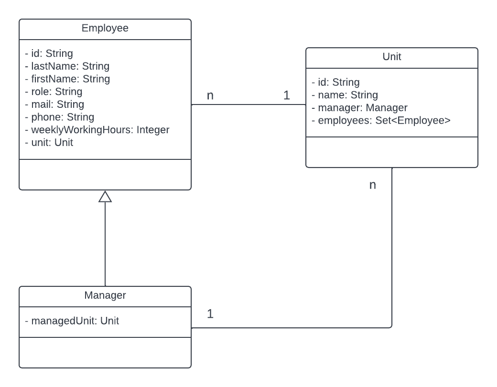

### Domain Model

Every employee ist part of a Unit (unit) which is managed by another employee (manager) and has employees. Some Employees
are managers and therefore have a unit which they manage (managedUnit).

### Architecture
The Onion Architecture as an instance of Clean Architecture with Dependency Inversion is used to make the architecture 
of the project as clean as possible by serparating the domain, application (which is called 'service' in this project) 
and adapter layers.

### Why Gradle Sub-Projects?
Gradle sub-projects are used to make shure that every developer working on this project cannot cross the boundaries of
the Onion Architecture and f. Ex. depend on the adapter layer from the application (aka service) layer.
This could also be achieved by using (ArchUnit) architecture tests but in my opinion gradle sub-projects are the cleaner 
and easier approach and therefore are my preferred way to go.